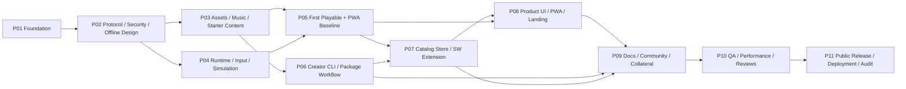

# Infinite Snowball Maestro Playbooks

This directory is the planning surface for the 11 Infinite Snowball phase documents. The files are ordered for Maestro-compatible execution and human review; they are not application source, deployment state, package manifests, lockfiles, or external resources.

## Ordered phase index

| Order | Phase | Exact filename | Title | Depends on | Primary boundary |
|---:|---|---|---|---|---|
| 1 | P01 | `Infinite-Snowball-Phase-01-Foundation.md` | Foundation and Quality Harness | none | future root workspace/config/lock/test harness/CI baseline only |
| 2 | P02 | `Infinite-Snowball-Phase-02-Protocol-Security-Offline-Design.md` | Protocol, Threat Model, Offline Transaction Design | P01 | packages/protocol/**, adversarial fixtures, catalog schemas, threat/policy docs |
| 3 | P03 | `Infinite-Snowball-Phase-03-Assets-Music-Starter-Content.md` | Cleared Assets, Music, Starter Content | P02 | asset tools/fixtures, starter content, provenance and third-party ledgers |
| 4 | P04 | `Infinite-Snowball-Phase-04-Runtime-Input-Simulation.md` | Runtime, Input, Deterministic Simulation | P01, P02 | engine/input/gameplay seams and performance telemetry |
| 5 | P05 | `Infinite-Snowball-Phase-05-First-Playable-Vertical-Slice.md` | First Playable Vertical Slice | P03, P04 | minimal `apps/web` Vite package with `private: true`, no future workspace deps, initial `apps/web/src/app/router.tsx` play route, PWA starter baseline, Dexie v1 saves/settings starter adapter, gameplay route integration, build-emitted inert same-origin CSP probe asset with path/hash, and vertical-slice tests |
| 6 | P06 | `Infinite-Snowball-Phase-06-Creator-CLI-Package-Workflow.md` | Creator CLI and Package Workflow | P02, P03 | CLI, templates/examples, submission fixtures |
| 7 | P07 | `Infinite-Snowball-Phase-07-Secure-Offline-Catalog-Store.md` | Secure Offline Installer, Catalog, Store Data | P05, P06 | content-runtime, controlled `apps/web/package.json` dependency/script update for `@infinite-snowball/content-runtime`, controlled `apps/web/src/sw.ts` extension, Dexie v1 migration plus catalog/store tables, SaveExport import/export, catalog registry, store data/controller layer, and rerun of P05 offline/CSP gates after build-affecting changes |
| 8 | P08 | `Infinite-Snowball-Phase-08-Product-UI-PWA-Landing.md` | Product UI, PWA, Landing | P05, P07 | shared UI package, controlled `apps/web/package.json` dependency/script update for `@infinite-snowball/ui`, exact `apps/web/src/app/router.tsx` landing/splash/store/settings registration, presentation layers for splash/HUD/pause/store/settings Save Data/landing/PWA prompts, and latest post-P08 CSP proof |
| 9 | P09 | `Infinite-Snowball-Phase-09-Docs-Community-Release-Collateral.md` | Mintlify Docs, Community, Release Collateral | P06, P07, P08 | docs excluding research, community files, README, screenshot manifest/captures/badges |
| 10 | P10 | `Infinite-Snowball-Phase-10-Cross-Device-QA-Performance-Review.md` | Cross-device QA, Performance, Mandatory Reviews | P09 | release-candidate Playwright config, frozen matrix schema, automated Chromium/Firefox/Playwright-WebKit plus `mobile-chromium`/`mobile-webkit` projects, manual shipping macOS Safari and real-iPhone Safari rows, performance/security/accessibility/release-candidate evidence, real-device save export/import, and targeted fixes coordinated with original area |
| 11 | P11 | `Infinite-Snowball-Phase-11-Public-Release-Deployment-Audit.md` | Public Repo, Packages, Deployment, Audit | P10 | concrete `tools/release/**` cutover/verification tooling, preserve-public or convert-private mode, release/deploy workflows, public conversion when needed, protected-CI npm dispatch/monitoring, Cloudflare/GitHub Pages/Mintlify live verification, rollback, README live checks, and final audit |

## Dependency graph



Canonical graph: `P01 -> P02 -> {P03 || P04}; P03 -> P06; {P03,P04} -> P05; {P05,P06} -> P07 -> P08 -> P09 -> P10 -> P11`.

## Parallelization and ownership boundaries

- P01 and P02 are prerequisites for the rest of the program and should run serially because they define workspace, protocol, security, and offline transaction contracts.
- P03 and P04 may run in parallel after P02: P03 owns assets/music/provenance/starter content, while P04 owns runtime/input/simulation/performance telemetry. They must not edit each other's directories.
- P06 may overlap P05 after P03 when files are disjoint, but P07 must wait for both P05 vertical-slice plus PWA offline baseline evidence, including `apps/web/package.json` with `private: true`, no `@infinite-snowball/content-runtime`/`@infinite-snowball/ui` predeclarations, exact initial `apps/web/src/app/router.tsx` play-route evidence, versioned Dexie v1 `saves`/`settings` persistence, the supplemental `VG-05-CSP-WASM` meta-only Chromium proof with artifact/policy/probe/WASM hashes, and P06 package-workflow handoff.
- P08 waits for P05 and P07 so UI states can reflect real starter gameplay, store/install behavior, the P07 SaveExport controller, and the P07 web-package handoff; only then may it add `@infinite-snowball/ui` and register landing/splash/store/settings routes without rewriting P05 play behavior. Any build-affecting P08 change reruns the P05/P08 manifest/offline and CSP proof before P10.
- P09 waits for P06, P07, and P08 so docs, screenshots, README, and contributor paths describe verified workflows and UI.
- P10 is the mandatory cross-device, performance, accessibility, security, license, matrix-schema, and code-review gate. It freezes the QA matrix before execution and consumes the latest post-P08 CSP proof. Targeted fixes must coordinate with the phase that owns the affected files.
- P11 runs only after P10 passes and must handle preserve-public or convert-private release mode, public repository controls, protected-CI npm dispatch/monitoring, web/docs deployment, check monitoring, rollback, live README verification, and final audit without stealing P09 docs authorship.

Ownership collision rules:

1. One phase owns each future file path at a time; a downstream phase consumes outputs instead of rewriting upstream contracts.
2. Shared boundaries are explicit handoffs: protocol schemas from P02, asset ledgers from P03, input/runtime contracts from P04, vertical-slice evidence plus the minimal private `apps/web` shell/PWA/Dexie v1 saves-settings baseline and initial play router from P05, CLI/catalog workflow from P06, content-runtime/store/runtime data, SaveExport, controlled package dependency/script update, and controlled SW extension from P07, UI contracts and router registration from P08, docs/screenshots from P09, review evidence from P10, and release/live evidence from P11.
3. Future `apps/web/package.json` ownership is sequential: P05 creates it with `private: true` and no dependencies on packages that do not yet exist, P07 may modify only dependencies/scripts for `@infinite-snowball/content-runtime` while preserving `private: true` and existing scripts, and P08 may modify only dependencies/scripts for `@infinite-snowball/ui` under the same preservation rule.
4. Future `apps/web/src/app/router.tsx` ownership is sequential: P05 creates the initial play route, P07 does not own the router, and P08 may register landing/splash/store/settings routes without rewriting P05 gameplay behavior.
5. The only planned service-worker ownership transfer is P05 creating `apps/web/src/sw.ts` for `VG-05-OFFLINE-RUN`, then P07 extending that same file for catalog/install caching while preserving the P05 regression; P05 also owns only the starter `apps/web/src/db/**` v1 saves/settings baseline and P07 owns its migration/preservation plus later catalog/store tables. No phase claims a P01-defined worker.
6. Security, licensing, offline, input, performance, UI accessibility, original-identity, no-backend-v1, controller, soundtrack, and worker boundaries are global constraints; no phase can weaken them.
7. Do not attach a phase to an unverified Maestro agent and do not mutate unrelated existing Auto Run documents.

## Maestro CLI 0.17.1 behavior

The bundled CLI path is:

```bash
node /Applications/Maestro.app/Contents/Resources/maestro-cli.js
```

Observed version and status from the reconciled brief:

- Version: `0.17.1`.
- Status result: `Maestro desktop app is not running`.
- No Infinite Snowball agent ID was verified.

Maestro 0.17.1 consumes existing playbook Markdown documents for Auto Run configuration; it does not synthesize these phase files. The later save template is exactly:

```bash
node /Applications/Maestro.app/Contents/Resources/maestro-cli.js auto-run .maestro/playbooks/Infinite-Snowball-Phase-*.md --agent <id> --save-as "Infinite Snowball"
```

The wildcard must resolve to the 11 phase documents listed in the ordered phase index above. The `<id>` must be a verified Infinite Snowball Maestro agent ID supplied later; never guess it and never reuse an unrelated agent ID.

### Save versus launch

`--save-as "Infinite Snowball"` saves/configures the Auto Run document under that name. It does not prove the run launched, does not attach to a new project automatically, and does not mutate unrelated agents. After saving, a human or verified automation must explicitly launch or monitor the saved Auto Run through Maestro with the correct verified agent context.

## Stop conditions

- Stop before any phase claims completion without its smallest meaningful verification and gate evidence.
- Stop before P07 unless P05 has passed the vertical-slice stop gate, including the P05-owned `apps/web` shell/PWA offline baseline, persisted Dexie v1 saves/settings restart evidence, and P06 has handed off exact package workflow evidence.
- Stop before P07 unless P05 attached manifest/router evidence proving `apps/web/package.json` is `private: true`, contains no dependency on not-yet-existing P07/P08 packages, and `apps/web/src/app/router.tsx` contains only the initial play route.
- Stop before P08 unless P07 attached manifest evidence proving `private: true`, existing P05 scripts and behavior are preserved, `@infinite-snowball/content-runtime` was added only after `packages/content-runtime/**` exists, and no `@infinite-snowball/ui` dependency or router ownership was taken early.
- Stop if any later phase drops `private: true`, predeclares a future workspace dependency, widens `apps/web/package.json` beyond its controlled dependency/script handoff, or rewrites `apps/web/src/app/router.tsx` outside the current sequential owner.
- Stop before any P11 cutover mutation unless all four external gates are resolved: GitHub account/org/repo administration, npm name/scope/2FA/trusted publishing, Cloudflare account/project/DNS credentials, and Mintlify project/domain credentials. These gates scope to release/cutover actions, not normal reviewed pushes to the already-initialized public repository. The exact P01 tracked/raw-output/secret audit, clean HEAD/index at the P10-approved SHA, forbidden-tracked-path audit, terminal-green CI `secret-scan`, and final-SHA review evidence must also be attached.
- Stop before VG-11-CHECKS unless all eleven named required repository checks (`lockfile`, `types`, `unit`, `build`, `content-policy`, `license-provenance`, `package-pack`, `e2e-offline`, `dependency-review`, `codeql`, `secret-scan`) reach terminal green for the release SHA; no-check is allowed only for explicitly non-required surfaces.
- Stop if Maestro status still indicates the desktop app is unavailable when an Auto Run must be saved or launched.
- Stop if no verified Infinite Snowball agent ID is available for `<id>`.
- Stop if any plan would create application source, package manifests, lockfiles, Git metadata, remotes, npm state, deployment config/state, or external resources during this planning-only phase.
- Stop if any phase weakens the settled security, licensing, offline, input, performance, UI, no-backend-v1, original-identity, controller, soundtrack, or worker boundaries.
